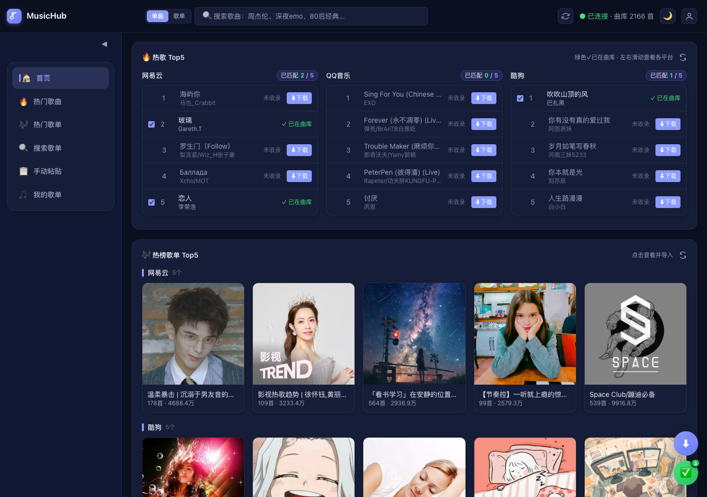
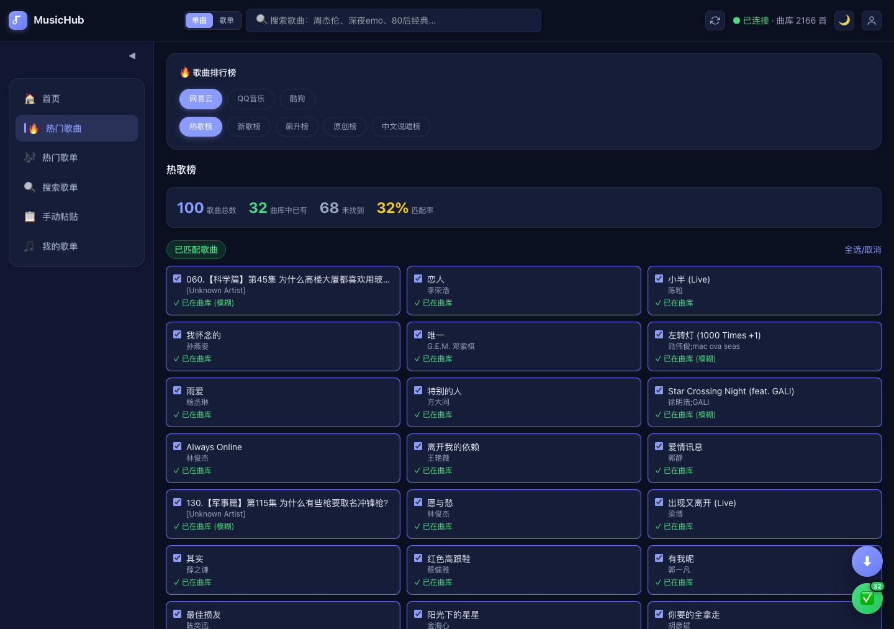
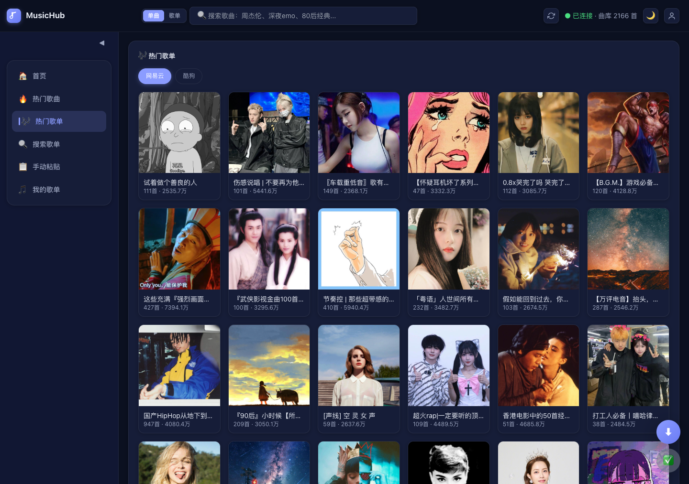

# MusicHub

聚合网易云、QQ音乐、酷狗、酷我等各大音乐平台的**热榜歌单**与**热榜歌曲**，与你本地的 [Navidrome](https://github.com/navidrome/navidrome) 曲库进行比对匹配，一键把网络歌单里已收录的歌曲转成 Navidrome 歌单；对未收录的歌曲提供下载 → 自动刮削元数据 → 按艺术家/专辑整理归档 → 触发曲库扫描的闭环，持续补充曲库内容。

## 🖼️ 效果图

| 首页（各平台热歌/热榜歌单聚合 + 曲库比对） | 热门歌曲（已匹配/未匹配分组） |
|:---:|:---:|
|  |  |

| 热门歌单（各平台歌单网格） | 搜歌单（跨平台歌单搜索） |
|:---:|:---:|
|  |  |

## ✨ 核心能力

### 📊 多平台热榜聚合 + 曲库比对
- **首页**：各平台热歌 Top5 + 热榜歌单 Top5 横向并列展示，每首歌标注是否已在曲库
- **热门歌曲**：网易云/QQ/酷狗排行榜（热歌榜、新歌榜、飙升榜等），已匹配/未匹配分组
- **热门歌单**：各平台热门歌单网格，点击进详情页
- **搜索**：单曲搜索 + 歌单搜索双模式，按关键词跨平台搜索
- 所有展示结果都与当前 Navidrome 曲库实时比对，明确标出「已收录 / 未收录」

### 🔄 下载 → 刮削 → 整理 → 扫描，自动补充曲库
对歌单中未收录的歌曲，提供一键下载闭环：
1. **下载**：调用各平台接口下载音频文件
2. **自动刮削**：下载完成后自动抓取元数据（标题/艺术家/专辑/封面）
3. **整理归档**：按「艺术家/专辑」结构整理到刮削目录
4. **触发扫描**：自动触发 Navidrome 扫描，新歌曲即时入库
5. 入库后再次匹配，曲库覆盖率持续提升

> 设置中可开关「自动刮削」，下载任务区实时展示进度。

### ✅ 基于网络歌单自动创建 Navidrome 歌单
- 在歌单详情页 / 首页勾选已匹配（已在曲库）的歌曲
- **创建歌单**：弹窗填名称、选封面（22 种主题风格自动生成 / 歌单原封面）、可删减歌曲，一键创建到 Navidrome
- **加入歌单**：追加到已有 Navidrome 歌单，自动跳过已存在的歌曲

### 🧠 智能匹配
- 精确匹配 + 模糊匹配（容忍歌名/艺术家差异）
- 跨平台结果按库内歌曲去重（同一首不会重复）
- 显示「歌曲总数 / 已有 / 未找到 / 匹配率」统计

## 🏠 多页面工作台

| 页面 | 说明 |
|------|------|
| 首页 | 各平台热歌/热榜歌单 Top5，可勾选已匹配歌曲创建歌单 |
| 热门歌曲 | 各平台歌曲排行榜，已匹配/未匹配分组 |
| 热门歌单 | 各平台热门歌单网格 |
| 搜索 | 单曲/歌单双模式搜索，结果同页展示 |
| 手动粘贴 | 粘贴歌单链接导入 |
| 我的歌单 | 查看 Navidrome 已有歌单（只读） |

## 🚀 使用方式

### 方式一：本地开发启动

```bash
# 1. 克隆
git clone <仓库地址>
cd music-hub

# 2. 创建虚拟环境并安装依赖
python3 -m venv .venv
.venv/bin/pip install -r requirements.txt

# 3. 配置环境变量
cp .env.example .env
# 编辑 .env 填入你的 Navidrome 地址、账号密码、Web 访问密码

# 4. 启动
.venv/bin/python app.py
```

浏览器打开 `http://127.0.0.1:8899`，输入 `.env` 里的 `LOGIN_PASSWORD` 登录。

> 必需的环境变量缺失时启动会报错退出，请确保 `.env` 配置完整。

### 方式二：Docker Compose 部署（推荐）

适合部署到 NAS / 服务器。

```bash
# 1. 克隆
git clone <仓库地址>
cd music-hub

# 2. 配置环境变量
cp .env.example .env
# 编辑 .env 填入实际值

# 3. 构建并启动
docker compose up -d --build
```

浏览器打开 `http://你的服务器IP:8899` 登录。

常用命令：

```bash
docker compose logs -f        # 查看日志
docker compose restart        # 重启
docker compose down           # 停止并删除容器
docker compose up -d --build  # 更新代码后重新构建部署
```

### 方式三：使用预构建镜像（GHCR）

打 tag 后 GitHub Actions 会自动构建并推送镜像到 ghcr.io，可直接拉取无需本地构建。

把 `docker-compose.yml` 里的 `build: .` 注释掉、取消 `image` 注释：

```yaml
services:
  musichub:
    image: ghcr.io/stone-yu/music-hub:latest
    container_name: musichub
    restart: unless-stopped
    ports:
      - "8899:8899"
    environment:
      NAVIDROME_URL: "http://你的Navidrome地址:4533/"
      NAVIDROME_USER: "你的用户名"
      NAVIDROME_PASS: "你的密码"
      LOGIN_PASSWORD: "你的Web访问密码"
      PORT: "8899"
      DOWNLOAD_DIR: "/app/downloads"
      SCRAPED_DIR: "/app/scraped"
      DATA_DIR: "/app/data"
    volumes:
      # 下载的歌曲（让 Navidrome 也挂载此目录即可扫描入库）
      - ./downloads:/app/downloads
      # 刮削整理后的歌曲（按 艺术家/专辑 结构）
      - ./scraped:/app/scraped
      # 持久化数据（download_task.json 等任务记录）
      - ./data:/app/data
```

```bash
docker compose up -d
```

> 首次使用需先打个 tag 触发构建：`git tag v1.0.0 && git push origin v1.0.0`。
> 构建完成后到 GitHub → Packages 把包可见性设为 public，才能免登录拉取。

## ⚙️ 环境变量

复制 `.env.example` 为 `.env` 并填入：

| 环境变量 | 必需 | 说明 | 示例 |
|---------|------|------|------|
| `NAVIDROME_URL` | ✅ | Navidrome 地址（末尾加 `/`） | `http://192.168.1.100:4533/` |
| `NAVIDROME_USER` | ✅ | Navidrome 用户名 | `admin` |
| `NAVIDROME_PASS` | ✅ | Navidrome 密码 | `your_password` |
| `LOGIN_PASSWORD` | ✅ | Web UI 访问密码 | `your_web_password` |
| `PORT` | ❌ | 服务端口（默认 8899） | `8899` |
| `DOWNLOAD_DIR` | ❌ | 下载目录（默认 /app/downloads） | `/app/downloads` |
| `DOWNLOAD_SOURCE` | ❌ | 默认下载来源平台（默认 酷我） | `酷我` |
| `SCRAPED_DIR` | ❌ | 刮削整理后归档目录（默认 /app/scraped） | `/app/scraped` |
| `DATA_DIR` | ❌ | 任务记录等持久化数据目录（默认 /app/data） | `/app/data` |
| `SEARCH_TIMEOUT` | ❌ | 搜索超时秒数（默认 10） | `10` |

## 📁 项目结构

```
music-hub/
├── app.py                 # FastAPI 主应用（入口）
├── config.py              # 配置（环境变量加载与校验）
├── app/                   # 业务代码包
│   ├── navidrome_client.py    # Navidrome Subsonic API 客户端
│   ├── cover_generator.py     # 封面生成器（22种主题）
│   ├── playlist_parser.py     # 歌单链接解析
│   ├── hot_playlists.py       # 各平台热门歌单
│   ├── hot_songs.py           # 各平台歌曲排行榜
│   ├── playlist_search.py     # 各平台歌单搜索
│   ├── downloader.py          # 音频下载
│   ├── metadata_sources.py    # 元数据源抽象
│   └── scraper.py             # 元数据刮削与整理归档
├── searchers/
│   └── __init__.py        # 多平台搜索引擎（酷我/网易/QQ/酷狗）
├── templates/
│   ├── login.html         # 登录页
│   └── app.html           # 主应用页（多页路由）
├── .env.example           # 环境变量模板
├── .github/workflows/     # GitHub Actions（自动构建 Docker 镜像到 ghcr.io）
├── Dockerfile
├── docker-compose.yml
└── requirements.txt
```

## 🛠️ 技术栈

- **后端**：Python + FastAPI + uvicorn
- **前端**：HTML + Tailwind CSS + 原生 JS（多页路由）
- **音乐平台**：网易云、QQ音乐、酷狗、酷我（非官方接口）
- **音乐服务器**：Navidrome (Subsonic API)
- **封面生成**：Pillow
- **部署**：Docker / Docker Compose / GHCR

## ⚠️ 注意事项

- 首次启动后台加载歌曲库（曲库越大越慢，317 位艺术家约 1-2 分钟）
- 各音乐平台接口为非官方逆向，可能随平台变动失效；已做容错，单平台挂了不影响其他
- 匹配含精确 + 模糊匹配，可能有遗漏或误判
- `NAVIDROME_URL` 建议用局域网 IP，速度更快
- 切勿将 `.env` 提交到 git（已在 `.gitignore` 中）

## 📄 免责声明

本项目**仅供学习和技术交流使用**，不存储、不分发任何音乐资源，所有数据均来自第三方公开接口。

- 请遵守所在地区著作权相关法律法规，下载的音乐资源请于 **24 小时内删除**，不得用于任何商业用途。
- 因使用本项目产生的任何法律后果由使用者自行承担，作者不承担任何责任。
- 如本项目侵犯了任何方的合法权益，请联系删除。

## 📄 License

MIT
